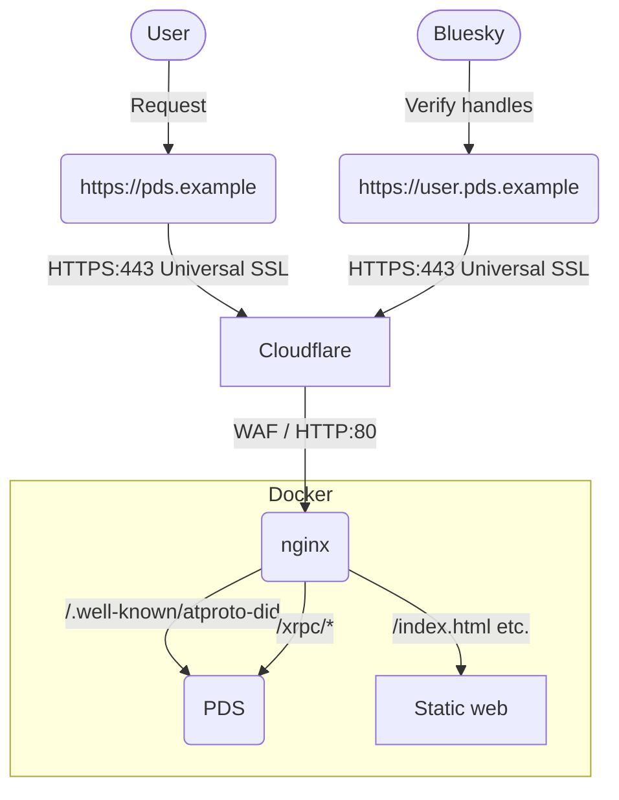

PDS 運用設定
==============

デフォルトで提供されているものからカスタムした実行環境を作成します。

# 動作環境

以下の環境で動作することを目的としています。

- Cloudflare DNS
- Linux (Ubuntu22)が動作可能な環境
- ドメイン (サブドメインではないととても扱い安い)


# できること

本リポジトリで公開している設定を用いるとできることは

- PDSのトップを任意のページに差し替えます
- ユーザーのハンドルをブラウザのアドレスバーに入力するとアカウントのプロフィールにリダイレクトします（bsky.appを利用）
- 複数のPDSを同居できます [複数のPDSを同居させる](docs/MultiplePDS.md)


# 構成図

目指している構成図は以下の通りとします。
AT Protocol側の構成は省略します




# PDSセットアップ

[公式ドキュメント](https://github.com/bluesky-social/pds/blob/main/README.md)に沿って `installer.sh` を実行。

サーバー内の `/pds` に設定に必要なコンテナ環境が構築されます。

インストーラーに従い、そのままアカウントを作成し。利用可能になります。

## Caddy について

デフォルトはCaddyをリバースプロキシとして起動し、HTTPS通信と証明書発行処理を自動で行ってくれます。

Caddyはリクエストがあった際にサーバーが証明書を持っていない場合、または有効期限が切れていた場合その場で証明書を発行リクエストし、適用します。

フローが完全に自動化されており、大変便利ですが、リクエストされたサブドメイン毎に発行され、ワイルドカードで発行されるわけではないので、個人的にはあまり効率的ではないかなと考えています。


### ハンドルの発行履歴からハンドルを推測できる

また、証明書の発行履歴はウェブ上から[追跡することも可能(crt.sh)](https://crt.sh/)なので、毎回証明書を発行されると、すぐに存在するハンドルを推測することができます。
またこれを追ってすぐにそのサブドメインに対して攻撃的なリクエストを送信してくるbotもあり、開発環境程度ならともかく、ある程度の運用を想定して利用するには健全な形ではないかなと考えています。


## nginxに置き換える

ここでは、Caddyを使用せず、nginxをWebサーバ兼リバースプロキシに置き換えて使用します。

SSL証明書まわりの運用を簡易にするため、nginxはHTTPのみで運用し、SSL証明書は Cloudflare DNSで発行されるものを使用します。

### CloudflareのUniversal証明書利用時の注意

CloudflareのUniversal証明書は無料で利用することができますが、発行対象はルートドメインと、そのサブドメインまでです。
2階層目以降のサブドメインには適用されません。

つまり、以下の様になります。

- ⭕ `example.com`
- ⭕ `pds.example.com`
- ⭕ `*.example.com`
- ❌ `*.pds.example.com`
- ❌ `*.abc.pds.example.com`


⭕Universal SSLの対象
❌Universal SSLの対象外

Universal SSLではなく、有料のAdvancedや持ち込みのCustom証明書を使用すればこの問題も解決できますが、何れも有償での利用となります。

## CloudflareのWebSocket設定

使用するドメインでWebSocket通信を許可していない場合、こちらを許可するように設定してください。


## 環境変数ファイルもまとめたい

まだデフォルト作成される `pds.env` ファイルを 環境変数を、ほかのコンテナで使用する分も管理しやすくするため `envs` ディレクト内に移動しています。


**サンプルの `pds.env-example` を各自で `envs/pds.env` にコピーし、書き換えて利用してください。**


# ディレクトリ構造

以下の形に整理しています

```plain
/pds
  ├/configs
  │ └/nginx　                       -- nginx用設定ディレクトリ
  │   ├/conf.d
  │   │  ├00_websocket.conf         -- WebSocket接続用設定
  │   │  ├default.conf
  │   │  ├pds.example-handle.conf   -- PDSのハンドル用
  │   │  └pds.example.conf          -- PDS用Proxy設定Proxy設定
  │   └/www
  │     └/var/www 配下に相当する場所、コンテンツ置き場
  ├/data                            -- PDS内で扱うデータ、自動生成される
  │  ├accounts.sqlite               -- PDSのアカウント管理
  │  ├/actors                       -- プロフィールで操作されたもの、アバター画像など
  │  ├/blocks                       -- 
  │  ├did_cache.sqlite              -- ハンドルとDIDのキャッシュ
  │  └sequencer.sqlite              -- シーケンスID管理
  ├/envs                            -- 環境変数置き場
  │ ├nginx.env                      -- nginxの環境設定
  │ └pds.env                        -- PDSの環境設定
  ├.gitignore
  ├pds.env-example                  -- PDS設定ファイルのサンプル設定
  └README.md                        -- このドキュメント
```


## デフォルトの場合

公式インストーラーをしようしてそのまま利用した際は以下の構成になっています。
`/pds` ディレクトリ内に設定ファイル、PDS内の各種DBファイルも一緒くたに入ります。

```plain
/pds
  ├/caddy
  │  ├/data
  │  │ └caddy           -- Caddyによって生成された証明書など(自動作成)
  │  └/etc
  │    └Caddyfile       -- Caddy設定ファイル
  ├pds.env              -- PDSの環境設定
  ├accounts.sqlite      -- PDSのアカウントDB(自動作成)
  ├/actors              -- プロフィールで操作されたもの、アバタなどアカウントデータ(自動作成)
  ├/blocks              -- (自動作成)
  ├did_cache.sqlite     -- ハンドルとDIDのキャッシュ(自動作成)
  └sequencer.sqlite     -- シーケンスID管理(自動作成)
```


# pdsadmin 使用時の注意


> [!WARNING]
> `pdsadmin` コマンドでは実行時に `/pds/pds.env` を参照しているため、 pds.env を移動すると参照不可でエラーになる。
> 
> この問題を解決するには以下の対策がある
> - pds.envを `/pds/pds.env` から移動しない
> - リンクファイルを作成して解決可能
>   - `ln -s envs/pds.env /pds/pds.env`
> - コマンド実行時に `PDS_ENV_FILE` を環境変数に指定する
>   - 例: `sudo PDS_ENV_FILE=/pds/envs/pds.env pdsadmin account list`

> [!CAUTION]
> `pdsadmin` にはPDSのアップデートを容易にしてくれる `pdsadmin update` コマンドがあります。
> これを実行すると、このリポジトリ内と同じ構成はリセットされ、公式のデフォルト構成で実行されるようになります。（データはリセットされません）
