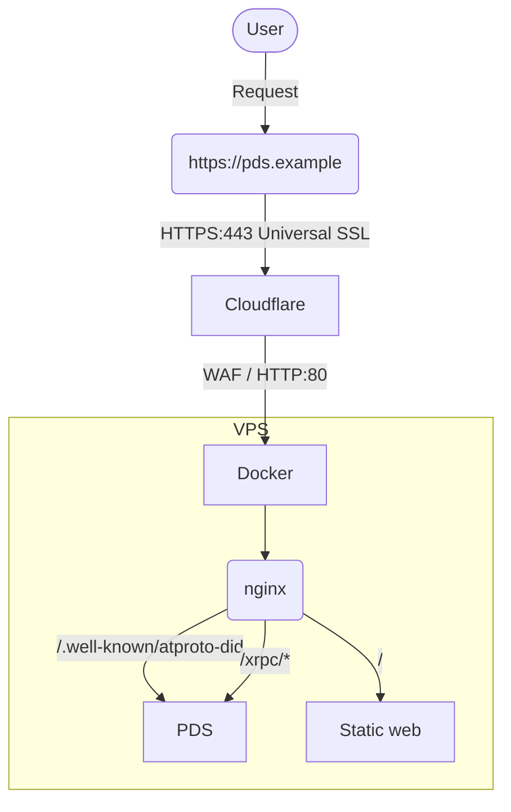

PDS 運用設定
==============

デフォルトの状態からカスタムして実行環境を作成しています。

# 構成図

目指している構成図は以下の通りとします。
AT Protocol側の構成は省略します




# PDSセットアップ

[公式ドキュメント](https://github.com/bluesky-social/pds/blob/main/README.md)に沿って `installer.sh` を実行

`/pds` に設定に必要なコンテナ環境が構築される。

そのまま管理者のアカウントを作成し。利用可能になる。

## Caddy について

デフォルトはCaddyをWebプロキシとして起動し、証明書発行処理を行う。

しかしCaddyは発行されるハンドル毎に（正しくは、アクセスがあった際に証明書が存在していないサブドメイン名に対して）一つずつ証明書を発行し、適用するためカウント数が増えると運用が煩雑になるおそれがある。（基本はそれでも問題ないと思う）

### ハンドルの発行履歴からハンドルを推測できる

証明書の発行履歴はウェブ上から[追跡することも可能(crt.sh)](https://crt.sh/)なので、毎回証明書を発行されると、すぐに存在するハンドルを推測することができる

## nginxに置き換える

そこでnginxをウェブサーバに置き換え、証明書を Cloudflare で発行されるものを使用します。


## 環境変数ファイルもまとめたい

まだデフォルト作成される `pds.env` ファイルを 環境変数をまとめて管理するための `envs` ディレクト内に格納し管理するように変更


> [!TIP]
> `pdsadmin` コマンドでは実行時に `/pds/pds.env` を参照しているため、 pds.env を移動すると参照不可でエラーになる。
> 
> この問題を解決するには以下の対策がある
> - pds.envを `/pds/pds.env` から移動しない
> - リンクファイルを作成して解決可能
>   - `ln -s envs/pds.env /pds/pds.env`
> - コマンド実行時に `PDS_ENV_FILE` を環境変数に指定する
>   - 例: `sudo PDS_ENV_FILE=/pds/envs/pds.env pdsadmin account list`


# ディレクトリ構造

以下の形に整理しています

```plain
/pds
  ├/configs
  │ └/nginx                 -- nginx用設定ディレクトリ
  │   ├/conf.d
  │   │  └default.conf      -- nginxからPDSにプロクシする設定
  │   └/www
  │     └/var/www 配下に相当する場所、コンテンツ置き場
  ├/data                    -- PDS内で扱うデータ、自動生成される
  │  ├accounts.sqlite       -- PDSのアカウント管理
  │  ├/actors               -- プロフィールで操作されたもの、アバター画像など
  │  ├/blocks               -- 不明
  │  ├did_cache.sqlite      -- ハンドルとDIDのキャッシュ
  │  └sequencer.sqlite      -- シーケンスID管理
  ├/envs                    -- 環境変数置き場
  │ ├nginx.env              -- nginxの環境設定
  │ └pds.env                -- PDSの環境設定
  ├.gitignore
  ├pds.env-example          -- PDS設定ファイルのサンプル設定
  └README.md                -- このドキュメント
```


# デフォルトの場合
`/pds` ディレクトリ内に設定ファイル、PDS内の各種DBファイルも一緒くたに入ります。
```plain
/pds
  ├/caddy
  │  ├/data
  │  │ └caddy           -- Caddyによって生成された証明書など
  │  └/etc
  │    └Caddyfile       -- Caddy設定ファイル
  ├pds.env              -- PDSの環境設定
  ├accounts.sqlite      -- PDSのアカウントDB
  ├/actors              -- プロフィールで操作されたもの、アバタなどアカウントデータ
  ├/blocks              -- 不明
  ├did_cache.sqlite     -- ハンドルとDIDのキャッシュ
  └sequencer.sqlite     -- シーケンスID管理