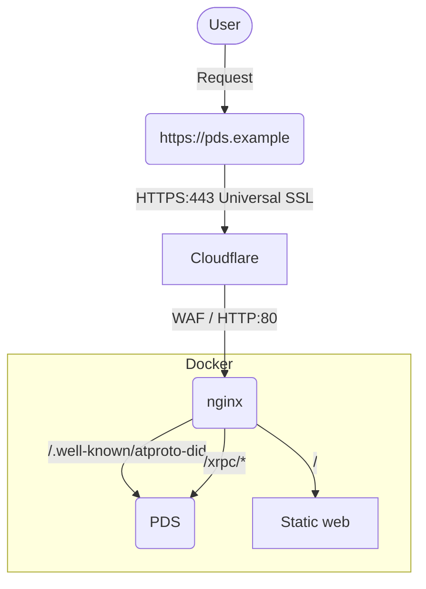

PDS 運用設定
==============

デフォルトで提供されているものからカスタムした実行環境を作成します。

# 動作環境

以下の環境で動作することを目的としています。

- Cloudflare DNS
- Linux (Ubuntu22)が動作可能な環境
- ドメイン (サブドメインではないととても扱い安い)


# できること

本リポジトリで公開している設定を用いるとできることは

- PDSのトップを任意のページに差し替えます
- ユーザーのハンドルをブラウザのアドレスバーに入力するとアカウントのプロフィールにリダイレクトします（bsky.appを利用）
- 複数のPDSを同居できます
  - `compose.yml` の更新、`config/nginx/conf.d/*` への追加、 `data` 以外のディレクトリを準備


# 構成図

目指している構成図は以下の通りとします。
AT Protocol側の構成は省略します




# PDSセットアップ

[公式ドキュメント](https://github.com/bluesky-social/pds/blob/main/README.md)に沿って `installer.sh` を実行。

サーバー内の `/pds` に設定に必要なコンテナ環境が構築されます。

インストーラーに従い、そのままアカウントを作成し。利用可能になります。

## Caddy について

デフォルトはCaddyをリバースプロキシとして起動し、HTTPS通信と証明書発行処理を自動で行ってくれます。

しかしCaddyは発行されるハンドル毎に（正しくは、アクセスがあった際に証明書が存在していないサブドメイン名に対して）一つずつ証明書を発行し、適用するためカウント数が増えると運用が煩雑になる可能性があります。（通常はそれでも問題ないと思いますが）

### ハンドルの発行履歴からハンドルを推測できる

証明書の発行履歴はウェブ上から[追跡することも可能(crt.sh)](https://crt.sh/)なので、毎回証明書を発行されると、すぐに存在するハンドルを推測することができます。

## nginxに置き換える

ここでは、Caddyを使用せず、nginxをWebサーバ兼リバースプロキシに置き換えて使用します。
SSL証明書は Cloudflare で発行されるものを使用します。

### CloudflareのUniversal証明書利用時の注意

CloudflareのUniversal証明書は無料で利用することができますが、発行対象はTLDとそのサブドメインまでです。
2階層目以降のサブドメインには適用されません。

つまり、以下の様になります。

- ⭕ `example.com`
- ⭕ `pds.example.com`
- ⭕ `*.example.com`
- ❌ `*.pds.example.com`
- ❌ `*.abc.pds.example.com`

Universal証明書ではなく、有料のAdvancedや持ち込みのCustom証明書を使用すればこの問題も解決できますが、コストがかかります。

## CloudflareのWebSocket設定

使用するドメインでWebSocket通信を許可していない場合、こちらを許可するように設定してください。


## 環境変数ファイルもまとめたい

まだデフォルト作成される `pds.env` ファイルを 環境変数を、ほかのコンテナで使用する分も管理しやすくするため `envs` ディレクト内に移動しています。


**サンプルの `pds.env-example` を各自で `envs/pds.env` にコピーし、書き換えて利用してください。**


# ディレクトリ構造

以下の形に整理しています

```plain
/pds
  ├/configs
  │ └/nginx                 -- nginx用設定ディレクトリ
  │   ├/conf.d
  │   │  └default.conf      -- nginxからPDSにプロクシする設定
  │   └/www
  │     └/var/www 配下に相当する場所、コンテンツ置き場
  ├/data                    -- PDS内で扱うデータ、自動生成される
  │  ├accounts.sqlite       -- PDSのアカウント管理
  │  ├/actors               -- プロフィールで操作されたもの、アバター画像など
  │  ├/blocks               -- 不明
  │  ├did_cache.sqlite      -- ハンドルとDIDのキャッシュ
  │  └sequencer.sqlite      -- シーケンスID管理
  ├/envs                    -- 環境変数置き場
  │ ├nginx.env              -- nginxの環境設定
  │ └pds.env                -- PDSの環境設定
  ├.gitignore
  ├pds.env-example          -- PDS設定ファイルのサンプル設定
  └README.md                -- このドキュメント
```


## デフォルトの場合

公式インストーラーをしようしてそのまま利用した際は以下の構成になっています。
`/pds` ディレクトリ内に設定ファイル、PDS内の各種DBファイルも一緒くたに入ります。

```plain
/pds
  ├/caddy
  │  ├/data
  │  │ └caddy           -- Caddyによって生成された証明書など
  │  └/etc
  │    └Caddyfile       -- Caddy設定ファイル
  ├pds.env              -- PDSの環境設定
  ├accounts.sqlite      -- PDSのアカウントDB
  ├/actors              -- プロフィールで操作されたもの、アバタなどアカウントデータ
  ├/blocks              -- 不明
  ├did_cache.sqlite     -- ハンドルとDIDのキャッシュ
  └sequencer.sqlite     -- シーケンスID管理
```


# pdsadmin 使用時の注意


> [!WARNING]
> `pdsadmin` コマンドでは実行時に `/pds/pds.env` を参照しているため、 pds.env を移動すると参照不可でエラーになる。
> 
> この問題を解決するには以下の対策がある
> - pds.envを `/pds/pds.env` から移動しない
> - リンクファイルを作成して解決可能
>   - `ln -s envs/pds.env /pds/pds.env`
> - コマンド実行時に `PDS_ENV_FILE` を環境変数に指定する
>   - 例: `sudo PDS_ENV_FILE=/pds/envs/pds.env pdsadmin account list`

> [!CAUTION]
> `pdsadmin` にはPDSのアップデートを容易にしてくれる `pdsadmin update` コマンドがあります。
> これを実行すると、このリポジトリ内と同じ構成はリセットされ、公式のデフォルト構成で実行されるようになります。（データはリセットされません）
